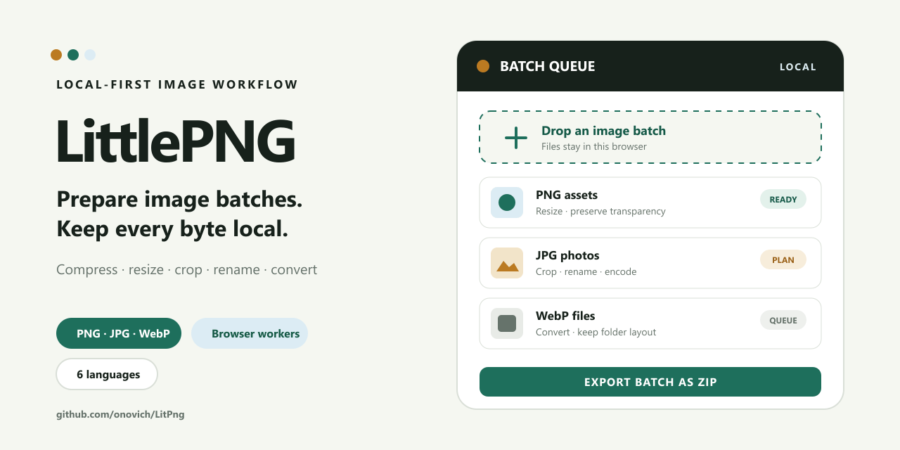

# LitPng

[简体中文](README.zh-CN.md)

A browser-local image workbench for batch compression, renaming, resizing,
cropping, and conversion.



## What it includes

- Runs locally in the browser; processing does not require uploads.
- Batch image transformation, renaming, and export.
- Custom naming templates with original, index, prefix, suffix, folder, and date tokens.
- Optional preservation of imported folder hierarchy inside ZIP exports.
- Rust `imagequant` WASM for lossy indexed PNG with palette alpha.
- `@jsquash/png` for lossless PNG and MozJPEG from `@jsquash/jpeg` for JPEG.
- Minimum-quality, lossless-fallback, and keep-original safeguards.
- Optional per-image target size using a bounded quality search.
- Downloadable CSV compression reports for completed batches.
- Keyboard-accessible before/after previews generated from the actual encoded output.
- One-click Shopify, WordPress, and Open Graph publishing presets.
- Browser-local saved custom presets with apply, overwrite, and delete controls.
- Opt-in local batch history with summary statistics and reusable settings, without storing image files.
- Bounded queue decoding, pause/resume/stop controls, 50-row pagination, and explicit completed-result cleanup.
- Up to six width variants per source, with individual downloads, ZIP export, and actual dimensions in CSV reports.
- Copy or download responsive HTML with actual-width `srcset` candidates and editable `sizes`.

## Getting started

Node.js 22.12+ and npm 9.6.5+ are required.

```bash
npm install
npm run dev
```

## Validation

```bash
npm run validate
npm run test:e2e
npm run audit:prod
npm run benchmark:codecs
```

An optional checksum-pinned real-image corpus can be fetched with
`npm run benchmark:fetch-corpus`. The benchmark records compression ratio,
browser processing time, encoder/fallback selection, and decoded PSNR. See
[`docs/codec-benchmark-baseline.md`](docs/codec-benchmark-baseline.md).

Rust and WASM codec commands:

```bash
npm run codec:check
npm run codec:test
npm run codec:build-wasm
```

## Repository map

- `apps/web/` — Astro and React frontend and browser workers.
- `packages/pngquant-wasm/` — Rust/WASM boundary for `imagequant`.
- `tests/` — Browser codec, SEO, and benchmark coverage.
- `research/` — Research notes and license-cleared corpus review.
- `docs/` — Product, architecture, codec, and workflow documentation.

## Documentation

- [`docs/commercial-roadmap.md`](docs/commercial-roadmap.md)
- [`docs/phase0-architecture.md`](docs/phase0-architecture.md)
- [`docs/pngquant-library-decision.md`](docs/pngquant-library-decision.md)
- [`docs/licensing-release-gate.md`](docs/licensing-release-gate.md)
- [`docs/publishing-presets.md`](docs/publishing-presets.md)
- [`docs/batch-history.md`](docs/batch-history.md)
- [`docs/large-queue.md`](docs/large-queue.md)
- [`docs/multi-size-outputs.md`](docs/multi-size-outputs.md)
- [`docs/srcset-export.md`](docs/srcset-export.md)
- [`docs/project-lessons.md`](docs/project-lessons.md)

## License

LittlePNG is licensed under GPL-3.0-or-later; see [LICENSE](LICENSE).
Third-party components retain their own licenses. Public releases must include
their notices and corresponding source information, as tracked in
[the release checklist](docs/licensing-release-gate.md).
